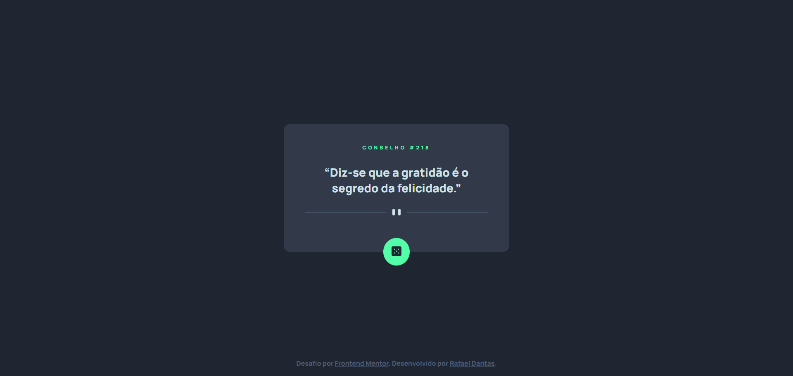

<a id="readme-top"></a>


# Gerador de Conselhos



> Receba conselhos para melhorar seu dia!

Projeto proposto por [Frontend Mentor](https://www.frontendmentor.io/challenges/advice-generator-app-QdUG-13db)

<a href="https://rafael-adgen.netlify.app/">Ver site</a>


<!-- SUMÁRIO -->
<details>
  <summary>Sumário</summary>
  <ol>
    <li><a href="#tecnologias">Tecnologias</a></li>
    <li><a href="#pré-requisitos">Pré-requisitos</a></li>
    <li><a href="#instalação">Instalação</a></li>
    <li><a href="#uso">Uso</a></li>
    <li><a href="#contato">Contato</a></li>
    <li><a href="#agradecimentos">Agradecimentos</a></li>
  </ol>
</details>


<!-- TECNOLOGIAS -->
## Tecnologias

* [![HTML][HTML-badge]][HTML-url]
* [![SASS][SASS-badge]][SASS-url]
* [![JavaScript][JavaScript-badge]][JavaScript-url]
* [![Axios][Axios-badge]][Axios-url]

<p align="right">(<a href="#readme-top">back to top</a>)</p>


<!-- PRÉ-REQUISITOS -->
## Pré-requisitos

* Git


<!-- INSTALAÇÃO -->
## Instalação

1. Clone o repositório
  ```sh
  git clone https://github.com/rafaelcfdantas/advice_gen.git
  ```

<p align="right">(<a href="#readme-top">back to top</a>)</p>


<!-- USO -->
## Uso

Utilize um servidor local de sua preferência (VSCode Live Server, nginx, Apache, etc).

Caso prefira, o projeto conta com um container Apache. Para inicializar o container basta abrir o terminal na pasta "docker" do projeto e digitar o comando
```sh
docker-compose up -d apache2
```

<p align="right">(<a href="#readme-top">back to top</a>)</p>


<!-- CONTATO -->
## Contato

[![GitHub][GitHub-badge]][GitHub-url]
[![LinkedIn][LinkedIn-badge]][LinkedIn-url]
[![Gmail][Gmail-badge]][Gmail-url]

<p align="right">(<a href="#readme-top">back to top</a>)</p>


<!-- AGRADECIMENTOS -->
## Agradecimentos

* [Frontend Mentor](https://www.frontendmentor.io/challenges/advice-generator-app-QdUG-13db)
* [Laradock](https://laradock.io/)

<p align="right">(<a href="#readme-top">back to top</a>)</p>


<!-- MARKDOWN LINKS & IMAGES -->
<!-- https://github.com/Ileriayo/markdown-badges -->

<!-- Social -->
[GitHub-badge]: https://img.shields.io/badge/GitHub-100000?style=for-the-badge&logo=github&logoColor=white
[GitHub-url]: https://github.com/rafaelcfdantas/
[LinkedIn-badge]: https://img.shields.io/badge/LinkedIn-0077B5?style=for-the-badge&logo=linkedin&logoColor=white
[LinkedIn-url]: https://www.linkedin.com/in/rafael-dantas-2019/
[Gmail-badge]: https://img.shields.io/badge/Gmail-D14836?style=for-the-badge&logo=gmail&logoColor=white
[Gmail-url]: mailto:rafael.cfd1999@gmail.com

<!-- Tecnologias -->
[HTML-badge]: https://img.shields.io/badge/html-white.svg?style=for-the-badge&logo=html5&logoColor=E34F26
[HTML-url]: https://developer.mozilla.org/pt-BR/docs/Web/HTML
[CSS-badge]: https://img.shields.io/badge/CSS-white?&style=for-the-badge&logo=css3&logoColor=blue
[CSS-url]: https://developer.mozilla.org/pt-BR/docs/Web/CSS
[SASS-badge]: https://img.shields.io/badge/Sass-CC6699?style=for-the-badge&logo=sass&logoColor=white
[SASS-url]: https://sass-lang.com/
[JavaScript-badge]: https://img.shields.io/badge/JavaScript-323330?style=for-the-badge&logo=javascript&logoColor=F7DF1E
[JavaScript-url]: https://developer.mozilla.org/pt-BR/docs/Web/JavaScript
[Bootstrap-badge]: https://img.shields.io/badge/Bootstrap-563D7C?style=for-the-badge&logo=bootstrap&logoColor=white
[Bootstrap-url]: https://getbootstrap.com
[Axios-badge]: https://img.shields.io/badge/Axios-ffffff?style=for-the-badge&logo=axios&logoColor=5A29E4
[Axios-url]: https://axios-http.com/